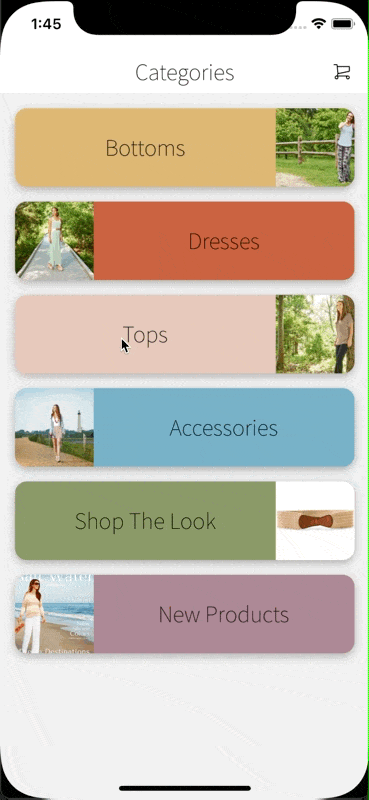

<h1 align="left">
   
  
</h1>

  
   
  
   
  
   
  

# Magento React Native Community
New version of the https://github.com/troublediehard/magento-react-native based on GraphQL api.     
Which will be covered with YouTube tutorials https://www.youtube.com/playlist?list=PL97fL9DAn9QyNAWAh-X-mFJdXKm96AqVM.

## 🎬 Demo

